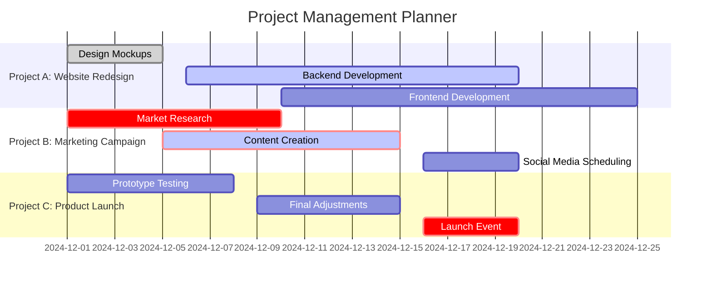
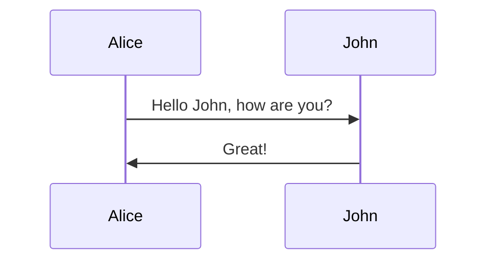

# Markdown syntax

# **VScode Tips & tricks.md**

- VScode: https://code.visualstudio.com/Download
- Extentions:
    * Better Comments by Aaron Bond
    * Markdown Table by Takumi Ishii
    * Cisco IOS Syntax by jamiewoodio
    * MySQL by Weijan Chen
    * Markdown Preview Mermaid Support by Matt Bierner

## You NEED to use VS Code RIGHT NOW! (remote SSH)
https://www.youtube.com/watch?v=1ZfO149BJvg&ab_channel=NetworkChuck

## 25 VS Code Productivity Tips and Speed Hacks
* https://www.youtube.com/watch?v=ifTF3ags0XI&ab_channel=Fireship

## VScode desde el broswer
https://vscode.dev/ 

https://www.markdownguide.org/basic-syntax/

# Title 1
## Title 2
### Title 3

<!-- c -->

texto normal

**Bold**
__Bold__

*cursive*

# comentarios con colores:
necesita extencion bettter comments

<!-- commentarios no se ve en el texto para presentar
seleccione el texto y presione Ctrl + /, para comentar texto -->

<!--! red comments -->
<!--? blue comments -->
<!--* ligth green -->
<!--todo orange -->

<!-- 
this
is 
a
multiline
comment
-->

# Block code:
<!-- https://markdown.land/markdown-code-block -->

### Linux bash machine:
```sh (Linux bash machine)

echo $PATH

ll
# este commando sirve para mostrar el contenido del directorio

```
### WIN Machine:
```bat (WIN Machine)
dir
: este commando sirve para mostrar el contenido del directorio
```
### python:
```py (python)
print("hello my people")
# este comando imprime "hello my people" en la terminal
```

# lista

* uno
    - uno y medio
* dos
    - dos y medio

### Check Box:


- [ ] A. option 1
- [x] B. option 2
- [ ] C. option 3
- [ ] D. option 4


### Create Tables like this:  
<!-- https://tableconvert.com/ (download markdown tables extention) -->
<!-- use <TAB> para "Tabular" para adelante, y Shift+TAB para ir para atras -->

| #   | student | homework | exam | FINAL |
| --- | ------- | -------- | ---- | ----- |
| 1   | student | 75       | 89.4 | 88    |
| 2   | student | 100      | 92.6 | 83.32 |
| 3   | student | 100      | 94.7 | 83.32 |

## Adjuntar una imagen: (Con el archivo de texto en el mismo folder que el .md)
<!-- user shortcut: Win+Shift+S -->


# Separacion (linea)

---
### elemento 1
---

# ascii ART:
> https://www.asciiart.eu/

```

▐▓█▀▀▀▀▀▀▀▀▀█▓▌░▄▄▄▄▄░
▐▓█░░▀░░▀▄░░█▓▌░█▄▄▄█░
▐▓█░░▄░░▄▀░░█▓▌░█▄▄▄█░
▐▓█▄▄▄▄▄▄▄▄▄█▓▌░█████░
░░░░▄▄███▄▄░░░░░█████░
```


# Vscode keystrokes and shortcuts:

Ctrl + S <!-- Save note (use auto-save > File > autosave) -->
Alt + Z <!-- Word Wrap (View > Word Wrap) -->
F2 <!-- change name -->
Alt + Shift <!-- Selecion en columna -->
Ctrl + Shift + F <!-- (find in files) -->
Ctrl + D <!-- selection de objetos iguales -->
Alt + up and down arrows <!-- mueve linea de arriba a abajo -->

### Create Diagramas ascii art : 

https://asciiflow.com/#/
```
!┌────┐                         ┌────┐
!│PC01│                         │PC02│
!└────┤  ┌────┐       ┌────┐    └──┬─┘
!     └──┤SW01├───────┤SW02│       │
!        └─┬──┘       └──┬─┴───────┘
!          │             │
!          │             │
!  Root  ┌─┴──┐       ┌──┴─┐
!      > │SW03├───────┤SW04│
!┌────┐  └──┬─┘       └─┬──┘    ┌────┐
!│PC03│     │           │       │PC04│
!└────┴─────┘           └───────┴────┘
```

# mermaid grafics:
*mermaid extension needed*



