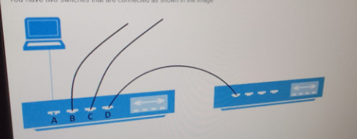

<!-- What is the purpose of assigning an IP address to the management VLAN interface of a layer 2 switch?

- - [ ] a. Enable the switch’s CLI to be accessed through on-band connections (telnet or SSH)
- - [ ] b. Enable the switch to provide DHCP services to other switches in the network.
- - [ ] c. Enable the switch to resolve URLs for the attached devices
- - [ ] d. Enable the switch to act as the default gateway for the gateway for the attached devices -->

<!-- A company’s switch is not accessible from the network. We need to review the current config, which out-of-band method can we use to access it? 
- - [ ] A. Telnet
- - [ ] B. SSH
- - [ ] C. SNMP
- - [ ] D. Console -->

PC-A send a frame to PC-C. Switch1 does not have a mapping entry for the MAC address of PC-C. Which action does Switch1 perform?
- - [ ] A. It drops the frame and send an error message back to PC-A.
- - [ ] B. It queries Switch2 for the MAC address of PC-C.
- - [ ] C. It floods the frame out all active ports except Fa0/1.
- - [ ] D. It send an ARP request to obtain the MAC address of PC-C

<!-- During the data encapsulation process, which OSI layer adds a header that contains MAC addressing information and a trailer used for error checking? 

- - [ ] A. Session 
- - [ ] B. Transport 
- - [ ] C. Data Link 
- - [ ] D. Network  -->

In the network shown in the following graphic, Switchl is a Layer 2 switch 

PC-A sends a frame to PC-C Switch I does not have a mapping entry for tne MAC address of PC-C Which scion does Swdchl taxed 

- [ ] A. Switchl drops the frame and sends an error message back to PC-A 
- [ ] B. Switch1 queries Switch2 for the MAC address of PC-C 
- [ ] C. Switch1 floods the frame out all active ports except port G0/1 
- [ ] D. Switch1 sends an ARP request to obtain the MAC address of PC-C 

You have two switches that are connected as shown in the image:

the laptop is connected to port A on the first switch. The second switch is connected to port D on the first swicth
the laptop sends a broadcast frame to the first switch
you need to identity the ports through which the broadcast frame are forwarded

which ports shoud you identify?

- [ ] A. D only
- [ ] B. B and C only
- [ ] C. A, B and D only
- [ ] D. B, C, and D onlyh

