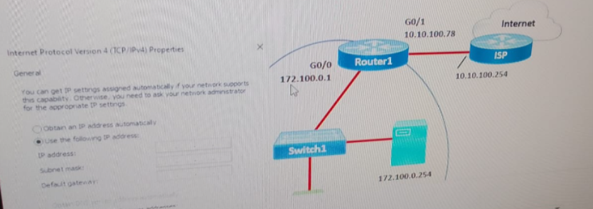

# Question


- Match the protocol with the description:

1. ICMP  
2. DHCP
3. DNS
 
[ ] Perform a query to translate companypro.net to an IP address 
[ ] Assign the reserved IP address 10.10.10.200 to a web server at your company 
[ ] Perform a ping to ensure that a server is responding to network connections 


# Question  
You want to list the IPv4 addresses associated with the host name www.companypro.net

Complete the command by selecting the correct option from each drop down list

Answer Area 
                    > 1. tracert           > A. www.companypro.net 
                    > 2. ipconfig          > B. companypro.com
                    > 3. nslookup          > C. www.companypro


# Question


A help desk technician is working on a computer that is unable to resolve URLs in the browser. The technician runs the ipconfig /all command and receives the following output:

```bat
Connection-specific DNS Suffix ...... local.co 
Physical Address .................... 0004.9A64.227D 
IPv4 Address ........................ 192.168.0.10 
Subnet Mask ......................... 255.255.255.0 
Default Gateway ..................... 192.168.0.1 
DHCP Servers ........................ 192.168.10.1 
DNS Servers ......................... 64.100.8.8 
```

You need to issue a command to view the network devices in the path from the computer to the server that resolves the host name 
Which command should you issue? Complete the command by selecting the correct option from each drop-down list 

Answer Area 

                    > 1. ipconfig            > A. 192.168.10.1 
                    > 2. nslookup            > B. 64.100.8.8
                    > 3. tracert             > C. 0004.9A64.227D


# Question



An administrator is configuring the host PC-A on the network shown in the following graphic. PC-A must be able to communicate on the local network and on the internet. There is no DHCP server on the network


* ip Address > ____________
* Subnetmask > ____________
* Default Gateway > __________