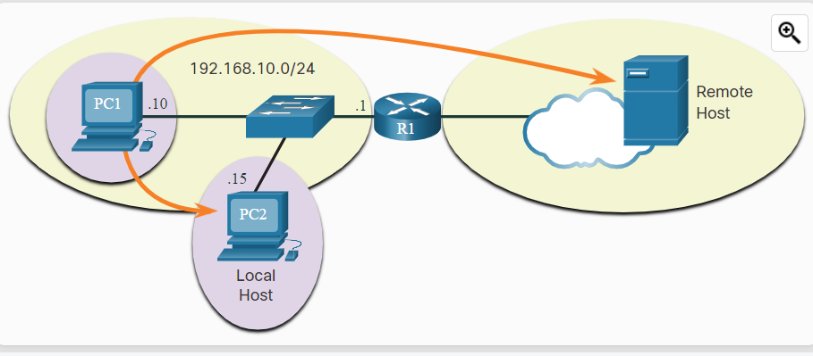

# Class 07.1: Routing Consepts 

## Reasons to divide a network into multiple smaller networks.
    - To maintain smaller broadcast domains
    - Large networks are more difficult to troubleshoot.
    - Increase network security


## Host Forwarding Decision (ARP 2nd part)

A PC or host can send a packet to three different destinations: itself, a local host on the same network, or a remote host on another network. Let’s break down each one.



### Itself:
A host can send a packet to itself, commonly called __pinging the loopback interface__. This __tests__ the host’s own network settings and TCP/IP configuration.

### Local host:
This is a destination on the __same local network__ as the sender. The source and destination __share the same network.__

### Remote host:
This is a destination on a __different network__. The source and destination __do not share the same network__ and communication must go through a router.

# Routing Table:

### ROUTER 2 (R2) routing table:

``` 
                                     31.13.67.0/24
                                          ISP
                                           |
                                           |
                          10.0.0.0/24      |
                                ▼          |
                   .1┌──┐ .1           .2┌─┴┐.1
                ┌────┤R1├────────────────┤R2├────┐
                │f0/1└──┘f0/0        f0/0└──┘f0/1│
192.168.20.0/24 |                                │  172.16.20.0/24
                │                                │
               ┌┴──┐.254                      ┌──┴┐ .254
         ┌─────┤SW1├────┐                   ┌─┤SW2├──────┐
         │     └───┘    │                   │ └───┘      │
         │              │                   │            │
       ┌─┴──┐       ┌───┴┐               ┌──┴─┐       ┌──┴─┐
       │PC-A│       │PC-B│               │PC-C│       │PC-D│
       └────┘       └────┘               └────┘       └────┘
         .10          .11                  .10          .11

Gateway of last resort is 0.0.0.0 to network 0.0.0.0

C       10.0.0.0/24 is directly connected, FastEthernet0/0
C       31.13.67.0/24 is directly connected, FastEthernet1/1
C       172.16.10.0/24 is directly connected, FastEthernet0/1
S     31.13.67.0/24 is directly connected, FastEthernet0/0


```

*Alert: Multiple Wi‑Fi networks can share the same name (SSID) but use different IP addresses. If your Sonos devices aren’t on the same network, expect connectivity issues.*
<!--! **Alert:** Multiple Wi‑Fi networks can share the **same name (SSID)** but use **different IP addresses**. If your **Sonos devices aren’t on the same network**, expect connectivity issues. -->

### PT Activity
<!--! PT Activity -->
Demostration 


# Class 07.2 NAT (Network Address Translation) 

A Network Address Translation (NAT) is a technique used in computer networking to allow **multiple devices to share a single public IP address**, let’s quickly review **the two main types of IPv4 addresses:**

A __private IP address__ is an IP address used within a private network. Private IP addresses are not unique and cans be reused within different private networks. Some common private IP address ranges include 10.0.0.0/8, 172.16.0.0/12, and 192.168.0.0/16.

A __public IP address__ is an IP address used to identify a device on the internet. Public IP addresses are unique and are assigned by Internet Service Providers (ISPs) to individual devices or networks.


# IPv4 exhaustion

__IPv4 exhaustion__ means we are running out of available IPv4 addresses, which are used to identify devices on the internet. This happened because the number of internet‑connected devices grew very fast.

To deal with this, NAT is used. Devices inside a private network use private IP addresses, and the router translates them into one public IP address when accessing the internet.

A __NAT translation table__ is used to keep track of the mapping between private IP addresses and public IP addresses. When a device with a private IP address sends a packet to the internet, the NAT device modifies the packet to replace the source IP address with a public IP address from the translation table.

__Double NAT__ occurs when two or more NAT devices are used in a network, creating two or more layers of private IP addresses. This can occur, for example, when a home router is connected to another router provided by an ISP or a network administrator.


*Alert: Sonos devices do not support Double NAT. To avoid issues, use only one NAT device or set the second router to bridge mode.*
<!--* Alert: Sonos devices do not support Double NAT. To avoid issues, use only one NAT device or set the second router to bridge mode. -->


### PT Activity
<!--! PT Activity -->
- check file: "075 PT simple nat"
- check file: "076 PT double nat"
